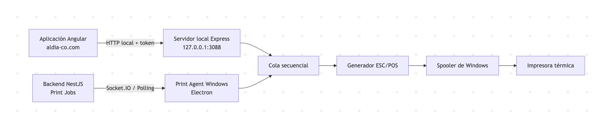
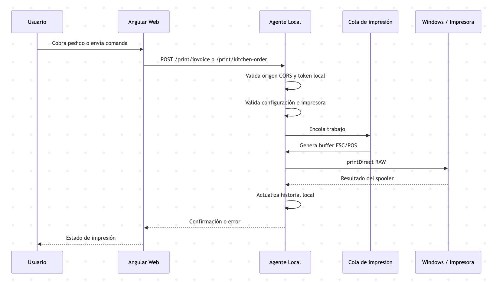
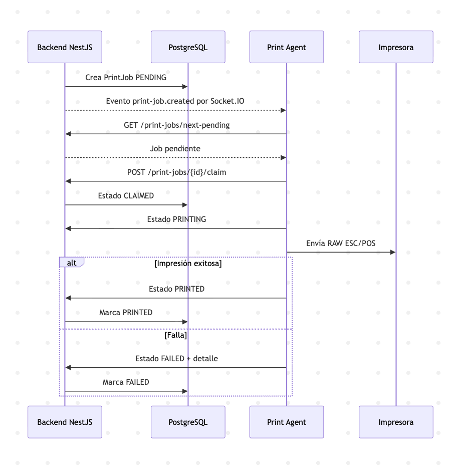
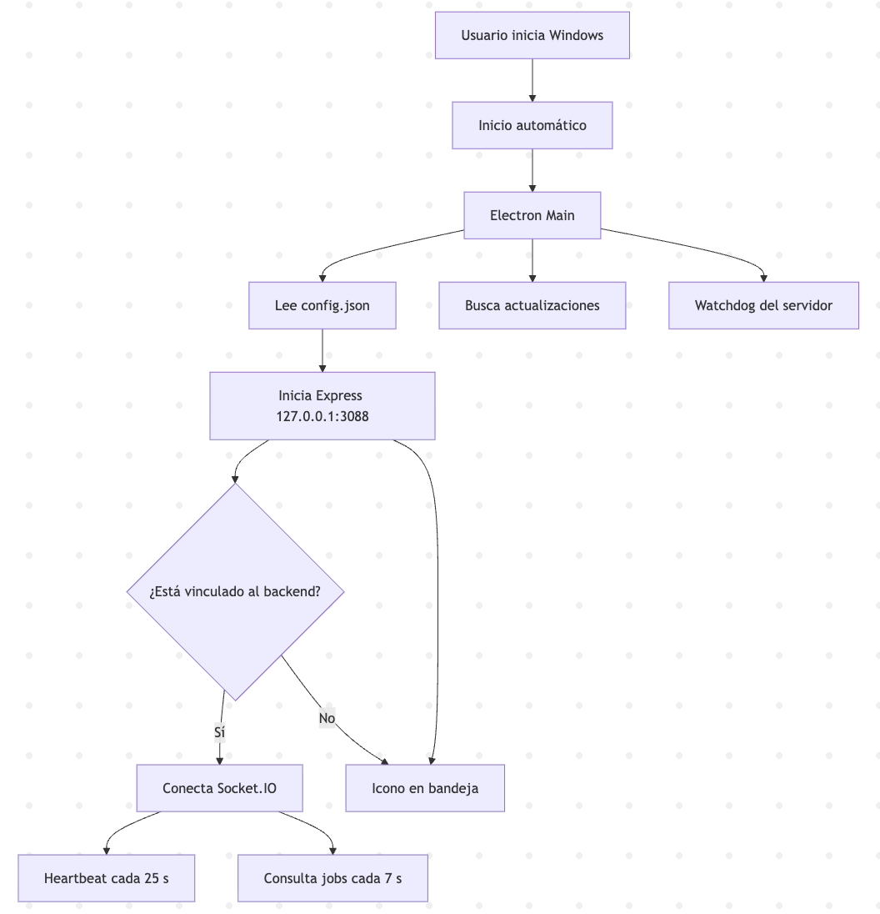

# Gestion al Dia Print Agent

Agente local para Windows que permite a la app web de Gestion al Dia imprimir directamente hacia impresoras termicas instaladas en Windows por medio de `http://127.0.0.1:3088`, sin abrir el dialogo del navegador.



## Por que Electron para este caso

- `Electron + Node.js`: mejor equilibrio para un `.exe` instalable, arranque con Windows, bandeja del sistema, servidor local embebido y acceso a librerias de impresion.
- `Tauri`: mas liviano, pero la capa de integracion con impresion RAW/ESC-POS en Windows suele terminar en codigo Rust o plugins propios.
- `.NET`: muy bueno para Windows y spooler, pero aleja la base del stack Node/Angular del equipo actual.
- `Go`: excelente para un servicio liviano, aunque la experiencia de bandeja, autoupdate y tooling de instalacion suele requerir mas trabajo adicional.

## Endpoints

- `GET /health`
- `GET /printers`
- `GET /config`
- `GET /jobs`
- `GET /monitor`
- `POST /config`
- `POST /print/test`
- `POST /print/invoice`
- `POST /print/kitchen-order`

Todos escuchan solo en `127.0.0.1:3088`.



Print desde conexión segura.



Flujo general



## Seguridad

- CORS restringido a `http://localhost:4200`, `http://127.0.0.1:4200`, `https://aldia-co.com` y `https://www.aldia-co.com` por defecto.
- Las llamadas desde la web publica hacia `127.0.0.1` responden el preflight de acceso local con `Access-Control-Allow-Private-Network: true`.
- Token local configurable por header `X-Gestion-Print-Token` o `Authorization: Bearer ...`.
- El token se guarda en el archivo local del agente para emparejar el navegador con el servicio.
- Si el navegador pierde su copia local del token, la app web autorizada puede recuperarlo de nuevo leyendo `GET /config` desde un origen permitido y seguir imprimiendo sin reemparejar manualmente.

## Configuracion local

El agente guarda un `config.json` en el directorio `userData` de Electron con:

- impresora de facturas
- impresora de comandas
- copias por tipo
- activacion de factura/comanda
- ancho de papel
- token de emparejamiento
- origenes CORS permitidos

Adicionalmente guarda un historial local `print-history.json` con los ultimos trabajos de impresion y su resultado.

## Monitor local

- Desde el icono de la bandeja puedes abrir `Ver historial de impresiones`.
- El monitor muestra el estado del servicio, la cola activa y los ultimos trabajos enviados.
- La vista local tambien queda disponible en `http://127.0.0.1:3088/monitor`.

## Flujo de build

1. Usa Node.js 22 en Windows.

2. Instala dependencias en Windows:

```bash
npm install
```

Si el proyecto sigue intentando resolver dependencias antiguas del modulo `printer`, puedes usar:

```bash
npm install --legacy-peer-deps
```

Despues de instalar, el proyecto aplica automaticamente un parche local sobre `printer` para corregir un error de compilacion en Windows/MSVC. Si necesitas ejecutarlo manualmente:

```bash
npm run patch:printer
```

3. Genera el ejecutable:

```bash
npm run dist:win
```

4. El instalador quedara en `release/`.

## Auto-actualizaciones

La base actual del agente ya es compatible con el objetivo correcto para Windows (`nsis`), que es el recomendado para actualizar con `electron-updater`.

### Lo que ya quedo integrado

- Dependencia `electron-updater` instalada en la app.
- Flujo de GitHub Actions que compila primero con `--publish never` y luego publica la release final en GitHub usando `gh release create` con todos los assets ya generados.
- Busqueda automatica de updates al iniciar el agente y comprobacion periodica en segundo plano.
- Descarga automatica en segundo plano e instalacion al cerrar la aplicacion.
- Workflow de GitHub Actions en `.github/workflows/release.yml` para compilar y publicar al subir un tag `v*`.

### Como publicar una nueva version

1. Sube el cambio de version en `package.json`.
2. Ejecuta manualmente el workflow `Release Print Agent` desde GitHub Actions, o crea y empuja un tag con formato `v1.0.1`.
3. GitHub Actions compilara Windows, creara el tag si hace falta, generara `latest.yml` y publicara la release de GitHub con el `.exe`, el `.blockmap` y el `latest.yml`.
4. No crees ni publiques esa version desde la pantalla de GitHub Releases antes de correr Actions; con releases inmutables cada tag se usa una sola vez.

Comandos de ejemplo:

```bash
git tag v2.0.6
git push origin v2.0.6
```

Las notas y el plan de verificacion de la version actual estan en [`docs/release-2.0.6.md`](docs/release-2.0.6.md).

### Advertencia importante sobre repo privado

GitHub Releases en un repo **privado** te sirve bien para publicar desde CI, pero **no es una buena opcion para clientes finales** si quieres auto-update transparente.

`electron-updater` solo puede consumir updates desde GitHub privado cuando la maquina cliente tiene `GH_TOKEN`, y la documentacion oficial lo considera un caso especial, no la ruta recomendada para distribucion amplia.

Si este agente lo van a instalar varios clientes, te recomiendo una de estas dos rutas:

1. mantener el repo de codigo privado y publicar los binarios en un repo publico solo de releases
2. mantener el repo privado y mover los binarios a un servidor HTTP/S3/generic provider

### Si decides seguir con GitHub Releases publico

Solo necesitas cambiar el repo de releases en `publish` si quieres separarlo del repo actual.

### Referencias oficiales

- electron-builder auto update: https://www.electron.build/docs/features/auto-update
- electron-builder publish: https://www.electron.build/docs/publish
- electron-builder GitHub Actions: https://www.electron.build/docs/features/github-actions

### Siguiente mejora posible

Si quieres una experiencia mas visible para el usuario, el siguiente paso es agregar una opcion en la bandeja para `Buscar actualizaciones ahora` y otra para `Reiniciar e instalar`.

## Nota sobre impresion RAW

El proyecto usa el modulo `printer` para listar impresoras y enviar bytes ESC/POS al spooler de Windows por nombre de impresora. Como es un modulo nativo y ademas es una dependencia vieja, debes:

- instalar y empaquetar el agente directamente en Windows
- preferir Node 22
- usar `npm install --legacy-peer-deps` si aparece conflicto de peer dependencies al instalar
