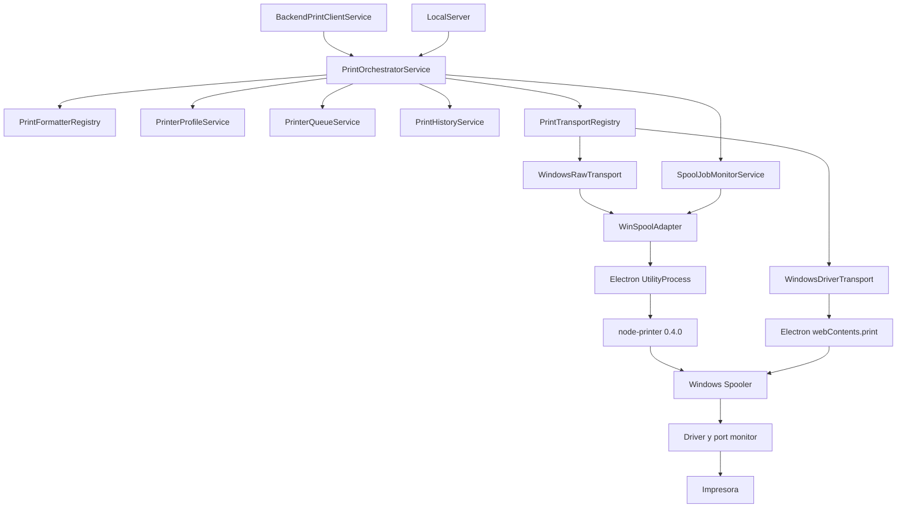

# Pipeline de impresion en Windows

## Alcance

El agente tiene un unico flujo de ejecucion para trabajos recibidos desde el backend y desde el servidor HTTP local. El flujo diferencia la aceptacion del trabajo por Windows de su terminacion observable en el spooler. Nunca afirma que el papel salio fisicamente si el driver, el port monitor y la impresora no ofrecen esa confirmacion.

## Arquitectura



`BackendPrintClientService` conserva WebSocket, polling, heartbeat, claim y llamadas HTTP. `LocalServer` expone la API local y el monitor. Ninguno formatea, encola ni llama a `node-printer` directamente.

## Estados locales

| Estado | Significado |
| --- | --- |
| `QUEUED` | Identidad local creada y pendiente en la cola de esa impresora. |
| `FORMATTING` | Se esta generando RAW ESC/POS o HTML. |
| `READY` | Documento generado, con bytes y hash registrados. |
| `SUBMITTING` | El transporte esta intentando entregar el trabajo a Windows. |
| `SUBMITTED` | Windows devolvio un JobId o Electron confirmo el submit. No significa impreso. |
| `SPOOLING` | Windows esta preparando el trabajo. |
| `PRINTING` | Windows reporta impresion/procesamiento. No confirma papel. |
| `SPOOL_COMPLETED` | El JobId fue `PRINTED`, o desaparecio despues de ser observado sin error. No confirma salida fisica. |
| `FAILED` | Fallo terminal controlado. Puede ser reintentable solo si Windows no acepto el trabajo. |
| `STUCK` | Trabajo aceptado que quedo bloqueado, offline, sin papel o excedio el timeout. |
| `CANCELLED` | Se elimino exclusivamente el JobId conocido y se confirmo su desaparicion. |
| `UNKNOWN` | Windows pudo aceptar el trabajo, pero no se pudo determinar el resultado. |

`JOB_STATUS_COMPLETE` se cierra como `SPOOL_COMPLETED` con el codigo `WINDOWS_JOB_COMPLETE_NO_PHYSICAL_CONFIRMATION`: Microsoft indica que Windows envio el trabajo a la impresora, pero no que el papel haya salido. El nombre del estado local describe terminacion del spooler, no confirmacion fisica.

## Transporte WINDOWS_RAW

1. El formatter genera bytes ESC/POS compatibles con el perfil.
2. `WindowsRawTransport` llama a `WinSpoolAdapter.submitRaw()`.
3. El adapter crea un `utilityProcess`; las APIs WinSpool bloqueantes no corren en el event loop principal de Electron.
4. El adapter serializa operaciones nativas; una consulta de salud no puede vencer su timeout mientras espera detras de un submit bloqueado.
5. El helper carga una unica ruta efectiva de `printer/lib/printer.js`.
6. `printDirect` usa `OpenPrinterW`, `StartDocPrinterW`, `StartPagePrinter`, `WritePrinter`, `EndPagePrinter` y `EndDocPrinter` y devuelve el JobId creado por `StartDocPrinterW`.
7. El JobId se persiste inmediatamente en el historial.
8. El monitor consulta `getJob(printerName, systemJobId)` hasta un estado terminal o el timeout configurado.

Un timeout de submit mata el helper y produce `SUBMIT_TIMEOUT_UNKNOWN`. No se reenvia el trabajo. Los fallos demostrablemente anteriores a `StartDocPrinterW` son `SAFE_TO_RETRY`; un fallo posterior posible es `UNSAFE_TO_RETRY`.

El parche local de `node-printer` agrega `statusNumber` al objeto de trabajo, corrige compatibilidad C++ y crea un wrapper canonico que conserva el JobId. El runtime registra modulo, binario, version, Electron, Node y arquitectura.

## Transporte WINDOWS_DRIVER

Este transporte crea un `BrowserWindow` oculto con `contextIsolation`, sin Node y con sandbox. Carga HTML escapado y usa:

```ts
webContents.print({
  silent: true,
  deviceName: profile.systemName,
  printBackground: true,
  margins: { marginType: 'none' },
  usePrinterDefaultPageSize: true,
});
```

El tamaño de rollo debe estar configurado correctamente en el driver de Windows. Electron no expone el Windows JobId de esta llamada. Un callback exitoso demuestra submit, pero el resultado local termina `UNKNOWN/UNSAFE_TO_RETRY`; la impresora se bloquea para impedir duplicados hasta una revision consciente. No existe fallback automatico de RAW a DRIVER.

## Perfil por impresora

`config.json` admite un perfil por `systemName`:

```json
{
  "printerProfiles": [
    {
      "systemName": "POS-80C",
      "transport": "WINDOWS_RAW",
      "paperWidth": "80mm",
      "charactersPerLine": 42,
      "raw": {
        "codePage": "CP850",
        "cutPaper": true,
        "openCashDrawer": false
      },
      "driver": {
        "usePrinterDefaultPageSize": true
      }
    }
  ],
  "printJobPollIntervalMs": 750,
  "printJobCompletionTimeoutMs": 45000,
  "maxPendingPrintJobsPerPrinter": 50
}
```

El transporte se cambia desde `/monitor`, `POST /printing/printers/profile` o editando la configuracion. El nombre debe ser el `deviceName/systemName` definido por Windows.

## Cola, copias y circuit breaker

- Cada `systemName` tiene una cadena independiente.
- Una misma impresora ejecuta trabajos en orden y sin concurrencia.
- Impresoras diferentes avanzan en paralelo.
- Cada copia tiene `localJobId`, `attemptId` y resultado propios.
- Una copia completa y otra fallida produce `PARTIAL_FAILURE`; la copia completa no se repite.
- `STUCK` o `UNKNOWN` bloquea solo esa impresora.
- El limite configurable aplica backpressure por impresora.

## Historial y reinicio

El historial conserva hasta 500 intentos en `print-history.json`. La escritura usa archivo temporal, `fsync`, cierre y `rename`; la version anterior se copia a `print-history.bak`.

Al arrancar:

- `QUEUED`, `FORMATTING` o `READY` interrumpido se cierra como `FAILED/SAFE_TO_RETRY` porque no llego al submit.
- `SUBMITTING` sin JobId se cierra como `UNKNOWN/UNSAFE_TO_RETRY` y bloquea la impresora.
- Un trabajo aceptado con JobId se consulta de nuevo; nunca se vuelve a enviar.
- Si el JobId desaparecio y habia sido observado, se marca `SPOOL_COMPLETED`; si nunca fue observado, queda `UNKNOWN`.

## API operativa

| Metodo y ruta | Funcion |
| --- | --- |
| `GET /printing/status` | Perfiles, salud, cola y ultimo trabajo por impresora. |
| `POST /printing/printers/profile` | Guarda transporte y opciones del perfil. |
| `POST /printing/printers/unblock` | Desbloqueo manual consciente. |
| `POST /printing/diagnostics/raw-minimal` | `ESC @` y texto ASCII, sin corte ni comandos adicionales. |
| `POST /printing/diagnostics/raw-full` | Ticket ESC/POS completo con perfil. |
| `POST /printing/diagnostics/driver` | HTML por el driver de Windows. |
| `GET /printing/diagnostics/export?printerName=...` | Driver, puerto, runtime, perfil, cola y ultimo JobId. |
| `POST /printing/jobs/:localJobId/refresh` | Consulta nuevamente ese JobId sin reenviar el documento. |
| `POST /printing/jobs/:localJobId/cancel` | Ejecuta `SetJob DELETE` para un unico Windows JobId y confirma su desaparicion. |

Los endpoints existentes `/print/test`, `/print/invoice` y `/print/kitchen-order` tambien usan el orquestador.

## Diagnostico de un STUCK

1. Abrir `/monitor` y revisar estado, Windows JobId, estado Win32, duracion y error.
2. Exportar el diagnostico para conocer `DriverName`, `PortName`, `PrintProcessor`, `Datatype` y `KeepPrintedJobs`.
3. Corregir papel, conexion, driver o puerto.
4. Si el trabajo sigue presente, usar **Cancelar este trabajo**. La accion aplica solo al JobId mostrado, nunca purga la impresora.
5. Esperar confirmacion `CANCELLED`; entonces el circuit breaker se abre nuevamente.
6. Ejecutar manualmente RAW minimo. Si RAW falla y la pagina de prueba del driver funciona, ejecutar la prueba DRIVER y revisar la instalacion RAW/driver/port.

El agente nunca reinicia el servicio Print Spooler, purga toda la cola ni activa globalmente “Print directly to the printer”.

## Backend changes required

No se cambia silenciosamente el contrato actual `PENDING/CLAIMED/PRINTING/PRINTED/FAILED/CANCELLED`.

- El backend recibe `PRINTED` solo para `SPOOL_COMPLETED`.
- `STUCK`, `UNKNOWN` y `PARTIAL_FAILURE` se reportan mediante eventos y no reciben `PRINTED` ni `FAILED` si Windows acepto alguna copia.
- Si se desea visualizar estos estados como primera clase, el backend debe ampliar su esquema/API. No es requisito para la seguridad local.
- Tras un reinicio, el agente reconcilia localmente sin reenviar. Para cerrar tambien un job backend que ya estaba `PRINTING`, se recomienda agregar una API idempotente de reconciliacion por `backendJobId + localJobId + windowsJobId`.

## Limitaciones conocidas

- El spooler no garantiza confirmacion fisica. Algunos port monitors reportan `PRINTED` antes de que el papel salga o no implementan TrueEndOfJob.
- `node-printer@0.4.0` no comprueba de forma diferenciada todos los retornos de `EndPagePrinter` y `EndDocPrinter`. El adapter aisla bloqueos y clasifica conservadoramente resultados dudosos, pero un bridge WinSpool propio sigue siendo la recomendacion de mediano plazo.
- El transporte DRIVER no entrega JobId en Electron y por ello no puede reconciliar o cancelar por JobId.
- La calidad de estados `OFFLINE`, `PAPEROUT` y `USER_INTERVENTION` depende del driver y port monitor instalados.

## Fuentes tecnicas

- [Microsoft: Sending Data Directly to a Printer](https://learn.microsoft.com/en-us/windows/win32/printdocs/sending-data-directly-to-a-printer)
- [Microsoft: WritePrinter](https://learn.microsoft.com/en-us/windows/win32/printdocs/writeprinter)
- [Microsoft: OpenPrinter](https://learn.microsoft.com/en-us/windows/win32/printdocs/openprinter)
- [Microsoft: GetJob](https://learn.microsoft.com/en-us/windows/win32/printdocs/getjob)
- [Microsoft: JOB_INFO_1](https://learn.microsoft.com/en-us/windows/win32/printdocs/job-info-1)
- [Microsoft: SetJob](https://learn.microsoft.com/en-us/windows/win32/printdocs/setjob)
- [Microsoft: PrintManagement](https://learn.microsoft.com/en-us/powershell/module/printmanagement/)
- [Electron: webContents.print and getPrintersAsync](https://www.electronjs.org/docs/latest/api/web-contents)
- [node-printer source](https://github.com/tojocky/node-printer)
- [Epson ESC/POS reference](https://download4.epson.biz/sec_pubs/pos/reference_en/index.html)
